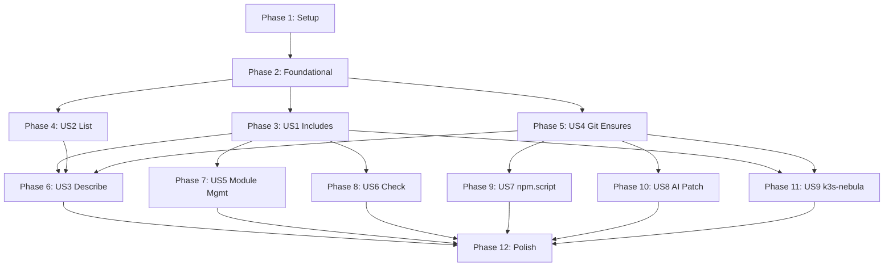

# Tasks: Gap Analysis

**Input**: Design documents from `/specs/002-gap-analysis/`  
**Prerequisites**: plan.md ✓, spec.md ✓, research.md ✓, data-model.md ✓, contracts/ ✓

**Tests**: Not explicitly requested in specification. Tests are omitted—add manually if TDD is desired.

**Organization**: Tasks grouped by user story to enable independent implementation and testing.

## Format: `[ID] [P?] [Story] Description`

- **[P]**: Can run in parallel (different files, no dependencies)
- **[Story]**: Which user story this task belongs to (US1–US9)
- Paths are relative to crates/ based on plan.md structure

---

## Phase 1: Setup (Shared Infrastructure)

**Purpose**: Project structure and trait abstractions

- [x] T001 Add `glob` dependency to `crates/core/Cargo.toml` for include pattern expansion
- [x] T002 [P] Create `crates/core/src/config/` directory for config loader module
- [x] T003 [P] Create `crates/core/src/ensure/` directory for ensure trait module

---

## Phase 2: Foundational (Blocking Prerequisites)

**Purpose**: Core abstractions that MUST be complete before ANY user story can be implemented

**⚠️ CRITICAL**: No user story work can begin until this phase is complete

- [x] T004 Define `Ensure` trait with `plan()` and `execute()` methods in `crates/core/src/ensure.rs`
- [x] T005 Create `EnsureContext` struct with `app_path`, `dry_run`, and `state` fields in `crates/core/src/ensure.rs`
- [x] T006 Create `EnsurePlan` struct for plan output in `crates/core/src/ensure.rs`
- [x] T007 [P] Add `includes: Vec<String>` field to `WeaverConfig` in `crates/core/src/config.rs`
- [x] T008 [P] Add `checks: Vec<CheckDef>` field to `AppConfig` in `crates/core/src/config.rs`
- [x] T009 Define `CheckDef` struct with `name`, `command`, `description` fields in `crates/core/src/config.rs`
- [x] T010 Export new modules in `crates/core/src/lib.rs` (ensure, config/loader)

**Checkpoint**: Foundation ready—user story implementation can now begin

---

## Phase 3: User Story 1 — Config Includes & Fragments (Priority: P1) 🎯 MVP

**Goal**: Enable modular config with `includes` glob patterns merging YAML fragments

**Independent Test**: Create `weaver.yaml` with `includes: ["weaver.d/*.yaml"]`, place app configs in fragments, run `rw apply` to verify merged config

### Implementation for User Story 1

- [x] T011 [US1] Create `crates/core/src/config/loader.rs` with module structure
- [x] T012 [US1] Implement `expand_includes(patterns: &[String], base: &Path) -> Result<Vec<PathBuf>>` using glob crate in `crates/core/src/config/loader.rs`
- [x] T013 [US1] Implement `merge_configs(base: Value, overlay: Value) -> Value` deep merge (maps merge, arrays concat) in `crates/core/src/config/loader.rs`
- [x] T014 [US1] Implement `load_with_includes(path: &Path) -> Result<WeaverConfig>` entry point in `crates/core/src/config/loader.rs`
- [x] T015 [US1] Add deterministic ordering: alphabetical glob expansion, later overrides earlier in `crates/core/src/config/loader.rs`
- [x] T016 [US1] Handle EC-001: Warn on empty glob matches (not error) in `crates/core/src/config/loader.rs`
- [x] T017 [US1] Handle EC-002: Error on duplicate app names across fragments in `crates/core/src/config/loader.rs`
- [x] T018 [US1] Add `mod loader` to `crates/core/src/config/mod.rs` and re-export
- [x] T019 [US1] Integrate `load_with_includes` into `rw apply` and `rw plan` commands in `crates/cli/src/commands/apply.rs`
- [x] T020 [US1] Add unit tests for merge algorithm in `crates/core/src/config/loader.rs`
- [x] T021 [US1] Add integration test for include expansion in `crates/cli/tests/integration/includes.rs`

**Checkpoint**: Config includes fully functional and testable

---

## Phase 4: User Story 2 — Discovery Commands (Priority: P1) 🎯 MVP

**Goal**: `rw list` command showing apps and tasks for workspace discoverability

**Independent Test**: Run `rw list` in workspace and verify apps/tasks are displayed per [cli-list.md](file:///Users/max/git/webtree/repo-weaver/specs/002-gap-analysis/contracts/cli-list.md) contract

### Implementation for User Story 2

- [x] T022 [US2] Create `crates/cli/src/commands/list.rs` with clap subcommand structure
- [x] T023 [US2] Implement `--json` flag for JSON output format in `crates/cli/src/commands/list.rs`
- [x] T024 [US2] Implement `--apps-only` and `--tasks-only` filter flags in `crates/cli/src/commands/list.rs`
- [x] T025 [US2] Implement default table output format (APPS section with name, path, module) in `crates/cli/src/commands/list.rs`
- [x] T026 [US2] Implement TASKS section output (app:task format with description) in `crates/cli/src/commands/list.rs`
- [x] T027 [US2] Handle empty workspace: "No apps defined" message (exit code 2) in `crates/cli/src/commands/list.rs`
- [x] T028 [US2] Register `list` subcommand in `crates/cli/src/commands/mod.rs`
- [x] T029 [US2] Add `list` to main CLI in `crates/cli/src/main.rs`
- [x] T030 [US2] Add integration test for list output in `crates/cli/tests/integration/list.rs`

**Checkpoint**: Discovery via `rw list` fully functional
- [x] Verify T022-T030
- [x] Run `rw list` and `rw list --json`


---

## Phase 5: User Story 4 — Git Submodule/Clone Pinned (Priority: P1) 🎯 MVP

**Goal**: Vendor upstream modules via `git.submodule` or `git.clone_pinned` ensures

**Independent Test**: Configure `ensure.git.submodule`, run `rw apply`, verify submodule added with correct ref

### Implementation for User Story 4

- [x] T031 [P] [US4] Implement `is_worktree_clean(path: &Path) -> Result<bool>` in `crates/ops/src/git.rs`
- [x] T032 [P] [US4] Implement `submodule_add(url: &str, path: &Path, ref_: &str) -> Result<()>` in `crates/ops/src/git.rs`
- [x] T033 [P] [US4] Implement `submodule_update(path: &Path, ref_: &str) -> Result<()>` in `crates/ops/src/git.rs`
- [x] T034 [P] [US4] Implement `clone_pinned(url: &str, path: &Path, ref_: &str) -> Result<()>` in `crates/ops/src/git.rs`
- [x] T035 [US4] Create `EnsureGitSubmodule` struct implementing `Ensure` trait in `crates/core/src/ensure/git.rs`
- [x] T036 [US4] Implement Safe Checkout: fail if dirty working tree (per spec clarification) in `crates/core/src/ensure/git.rs`
- [x] T037 [US4] Create `EnsureGitClonePinned` struct implementing `Ensure` trait in `crates/core/src/ensure/git.rs`
- [x] T038 [US4] Handle EC-005: Network failure fallback to cache (warn if exists, fail if not) in `crates/core/src/ensure/git.rs`
- [x] T039 [US4] Create `crates/core/src/ensure/mod.rs` with type registry and dispatcher
- [x] T040 [US4] Register `git.submodule` and `git.clone_pinned` ensure types in dispatcher
- [x] T041 [US4] Integrate ensure dispatcher into `rw apply` in `crates/cli/src/commands/apply.rs`
- [x] T042 [US4] Add integration test for git.submodule ensure in `crates/cli/tests/integration/git_ensure.rs`

**Checkpoint**: Git ensures fully functional with dirty tree detection

---

## Phase 6: User Story 3 — App Inspection (Priority: P2)

**Goal**: `rw describe <app>` command showing fully resolved app config

**Independent Test**: Run `rw describe my-app` and verify resolved config per [cli-describe.md](file:///Users/max/git/webtree/repo-weaver/specs/002-gap-analysis/contracts/cli-describe.md) contract

### Implementation for User Story 3

- [x] T043 [US3] Create `crates/cli/src/commands/describe.rs` with clap subcommand structure
- [x] T044 [US3] Implement app lookup with error message listing available apps in `crates/cli/src/commands/describe.rs`
- [x] T045 [US3] Implement default YAML-like output format in `crates/cli/src/commands/describe.rs`
- [x] T046 [US3] Implement secrets redaction (show as `***`) in `crates/cli/src/commands/describe.rs`
- [x] T047 [US3] Implement `--show-secrets` flag with confirmation prompt in `crates/cli/src/commands/describe.rs`
- [x] T048 [US3] Implement `--json` flag for JSON output in `crates/cli/src/commands/describe.rs`
- [x] T049 [US3] Register `describe` subcommand in `crates/cli/src/commands/mod.rs` and `main.rs`

**Checkpoint**: App inspection via `rw describe` fully functional

---

## Phase 7: User Story 5 — Module Management Commands (Priority: P2)

**Goal**: `rw module list` and `rw module update` for dependency management

**Independent Test**: Run `rw module list` and `rw module update foo --ref v2.0.0` per [cli-module.md](file:///Users/max/git/webtree/repo-weaver/specs/002-gap-analysis/contracts/cli-module.md) contract

### Implementation for User Story 5

- [ ] T050 [US5] Create `crates/cli/src/commands/module.rs` with clap subcommand nesting
- [ ] T051 [US5] Implement `module list` subcommand with table output in `crates/cli/src/commands/module.rs`
- [ ] T052 [US5] Implement `module list --json` output format in `crates/cli/src/commands/module.rs`
- [ ] T053 [US5] Implement `module update <name> --ref <ref>` subcommand in `crates/cli/src/commands/module.rs`
- [ ] T054 [US5] Implement weaver.yaml modification for ref update in `crates/cli/src/commands/module.rs`
- [ ] T055 [US5] Implement module cache clearing (unless `--no-fetch`) in `crates/cli/src/commands/module.rs`
- [ ] T056 [US5] Handle module not found error with available modules list in `crates/cli/src/commands/module.rs`
- [ ] T057 [US5] Register `module` subcommand in `crates/cli/src/commands/mod.rs` and `main.rs`

**Checkpoint**: Module management via `rw module` fully functional

---

## Phase 8: User Story 6 — Validation Commands (Priority: P2)

**Goal**: `rw check [app]` command executing defined validation checks

**Independent Test**: Define `checks` in app config, run `rw check`, verify checks execute

### Implementation for User Story 6

- [ ] T058 [US6] Create `crates/cli/src/commands/check.rs` with clap subcommand structure
- [ ] T059 [US6] Implement check command execution via shell in `crates/cli/src/commands/check.rs`
- [ ] T060 [US6] Implement per-app filtering with `rw check <app>` in `crates/cli/src/commands/check.rs`
- [ ] T061 [US6] Implement check result reporting (pass/fail per check) in `crates/cli/src/commands/check.rs`
- [ ] T062 [US6] Handle "No checks defined" message gracefully in `crates/cli/src/commands/check.rs`
- [ ] T063 [US6] Set non-zero exit code on check failure in `crates/cli/src/commands/check.rs`
- [ ] T064 [US6] Register `check` subcommand in `crates/cli/src/commands/mod.rs` and `main.rs`

**Checkpoint**: Validation via `rw check` fully functional

---

## Phase 9: User Story 7 — npm.script Ensure (Priority: P2)

**Goal**: Ensure npm scripts via `npm pkg set` native tooling

**Independent Test**: Configure `ensure.npm.script`, run `rw apply`, verify script in package.json

### Implementation for User Story 7

- [ ] T065 [P] [US7] Create `crates/ops/src/npm.rs` with npm command wrappers
- [ ] T066 [US7] Implement `npm_pkg_set_script(name: &str, command: &str, cwd: &Path) -> Result<()>` in `crates/ops/src/npm.rs`
- [ ] T067 [US7] Implement `npm_pkg_get_script(name: &str, cwd: &Path) -> Result<Option<String>>` for diff detection in `crates/ops/src/npm.rs`
- [ ] T068 [US7] Create `EnsureNpmScript` struct implementing `Ensure` trait in `crates/core/src/ensure/npm.rs`
- [ ] T069 [US7] Handle EC-004: Fail with actionable error if package.json missing in `crates/core/src/ensure/npm.rs`
- [ ] T070 [US7] Register `npm.script` ensure type in dispatcher in `crates/core/src/ensure/mod.rs`
- [ ] T071 [US7] Export npm module in `crates/ops/src/lib.rs`

**Checkpoint**: npm.script ensure fully functional

---

## Phase 10: User Story 8 — AI Patch Ensure (Priority: P3)

**Goal**: AI-generated patches with verify/rollback safety protocol

**Independent Test**: Configure `ensure.ai.patch` with verify command, run `rw apply`, verify patch and rollback on failure

### Implementation for User Story 8

- [ ] T072 [US8] Create `crates/core/src/ensure/ai.rs` with `EnsureAiPatch` struct
- [ ] T073 [US8] Implement AI CLI invocation (Claude CLI) for diff generation in `crates/core/src/ensure/ai.rs`
- [ ] T074 [US8] Implement git-based diff application in `crates/core/src/ensure/ai.rs`
- [ ] T075 [US8] Implement verification command execution in `crates/core/src/ensure/ai.rs`
- [ ] T076 [US8] Implement automatic rollback on verify failure in `crates/core/src/ensure/ai.rs`
- [ ] T077 [US8] Handle EC-003: Fail with clear error if no git repo in `crates/core/src/ensure/ai.rs`
- [ ] T078 [US8] Register `ai.patch` ensure type in dispatcher in `crates/core/src/ensure/mod.rs`

**Checkpoint**: AI patch ensure with rollback safety fully functional

---

## Phase 11: User Story 9 — k3s-nebula End-to-End Validation (Priority: P1) 🎯 MVP

**Goal**: Validate complete workflow per PRD §14 acceptance criteria

**Independent Test**: Bootstrap k3s-nebula workspace from zero, run `rw apply`, execute `rw run app install`

### Implementation for User Story 9

- [x] T079 [US9] Create k3s-nebula module fixture in `tests/fixtures/modules/k3s-nebula/`
- [x] T080 [US9] Create end-to-end test scenario in `crates/cli/tests/integration/k3s_nebula.rs`
- [x] T081 [US9] Verify Taskfile + tfvars generation in test in `crates/cli/tests/integration/k3s_nebula.rs`
- [x] T082 [US9] Verify pipeline execution order (terraform plan, apply, output capture, kubectl) in test
- [x] T083 [US9] Verify SC-001: Bootstrap under 30 seconds in `crates/cli/tests/integration/k3s_nebula.rs`

**Checkpoint**: k3s-nebula workflow validated against PRD §14

---

## Phase 12: Polish & Cross-Cutting Concerns

**Purpose**: Improvements affecting multiple user stories

- [ ] T084 [P] Update CLI help text for all new commands in `crates/cli/src/main.rs`
- [ ] T085 [P] Add success criteria validation: `rw list` under 1s (SC-002) via benchmark test
- [ ] T086 [P] Add success criteria validation: includes merge under 2s for 10+ files (SC-003) via benchmark test
- [ ] T087 Documentation: Update README.md with new commands and ensure types
- [ ] T088 Code cleanup: Ensure consistent error handling across all new code
- [ ] T089 Run `cargo clippy` and fix all warnings
- [ ] T090 Run quickstart.md validation manually

---

## Dependencies & Execution Order

### Phase Dependencies



### P1 User Stories (MVP)

| Story | Depends On | Can Parallelize With |
|-------|------------|---------------------|
| US1 (Includes) | Foundational | US2, US4 |
| US2 (List) | Foundational | US1, US4 |
| US4 (Git Ensures) | Foundational | US1, US2 |
| US9 (k3s-nebula) | US1, US4 | - |

### P2 User Stories

| Story | Depends On | Can Parallelize With |
|-------|------------|---------------------|
| US3 (Describe) | US1, US2 | US5, US6, US7 |
| US5 (Module Mgmt) | US1 | US3, US6, US7 |
| US6 (Check) | US1 | US3, US5, US7 |
| US7 (npm.script) | Foundational, US4 | US3, US5, US6 |

### P3 User Stories

| Story | Depends On | Can Parallelize With |
|-------|------------|---------------------|
| US8 (AI Patch) | Foundational, US4 | Any P2 stories |

---

## Parallel Opportunities

### Within Setup (Phase 1)
```bash
# All setup tasks can run in parallel:
T002: Create crates/core/src/config/ directory
T003: Create crates/core/src/ensure/ directory
```

### Within Foundational (Phase 2)
```bash
# These can run in parallel:
T007: Add includes field to WeaverConfig
T008: Add checks field to AppConfig
T009: Define CheckDef struct
```

### Across P1 Stories (After Foundational)
```bash
# Three P1 stories can be worked in parallel by different developers:
Developer A: US1 (T011-T021) — Config Includes
Developer B: US2 (T022-T030) — Discovery Commands  
Developer C: US4 (T031-T042) — Git Ensures
```

### Within US4 (Git Ensures)
```bash
# Ops functions can be implemented in parallel:
T031: is_worktree_clean in ops/git.rs
T032: submodule_add in ops/git.rs
T033: submodule_update in ops/git.rs
T034: clone_pinned in ops/git.rs
```

---

## Implementation Strategy

### MVP First (P1 Stories Only)

1. Complete **Phase 1**: Setup (T001-T003)
2. Complete **Phase 2**: Foundational (T004-T010)
3. Complete **Phase 3**: US1 Includes (T011-T021)
4. Complete **Phase 4**: US2 List (T022-T030)
5. Complete **Phase 5**: US4 Git Ensures (T031-T042)
6. Complete **Phase 11**: US9 k3s-nebula Validation (T079-T083)
7. **STOP and VALIDATE**: All P1 stories complete and tested

### Incremental Delivery

| Milestone | Stories | Deliverable |
|-----------|---------|-------------|
| M1 | Setup + Foundational | Trait abstractions ready |
| M2 | +US1, +US2 | Modular config + discovery |
| M3 | +US4 | Git vendoring works |
| M4 | +US9 | PRD §14 validated - **MVP Complete** |
| M5 | +US3, +US5, +US6, +US7 | P2 features complete |
| M6 | +US8 | AI patch available |

---

## Notes

- [P] tasks = different files, no dependencies on incomplete tasks
- [Story] label maps task to specific user story
- Each user story is independently completable and testable
- Commit after each task or logical group
- Stop at any checkpoint to validate story independently
- Tests not included per spec—add with TDD approach if desired
