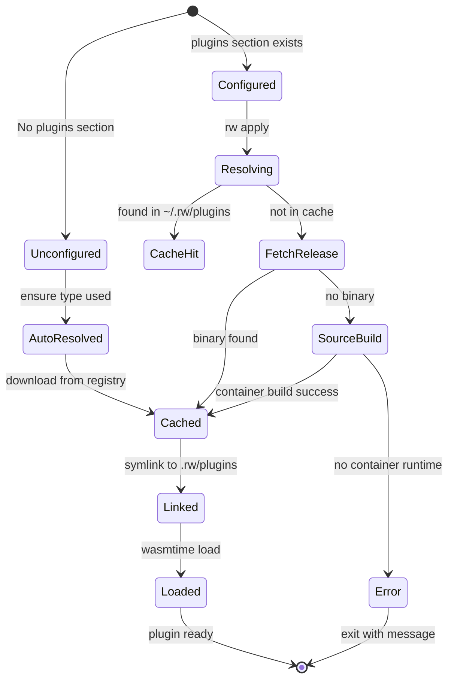

# Data Model: Plugin Management System

**Feature**: 003-plugin-management-system  
**Date**: 2026-01-17

## Core Entities

### Plugin

A WASM component implementing the `ensure-provider` WIT interface.

```text
Plugin
├── name: String            # Unique identifier (e.g., "npm-script")
├── version: String         # Semantic version or git ref (e.g., "v1.0.0", "abc123")
├── source: PluginSource    # Where the plugin comes from
├── wasm_path: PathBuf      # Resolved path to .wasm file
├── capabilities: Vec<Cap>  # Granted capabilities (future)
└── metadata: PluginMetadata
```

### PluginSource (Enum)

```text
PluginSource
├── Local { path: PathBuf }
├── Git { url: String, ref: String }
└── Registry { name: String }     # Auto-resolved from default registry
```

### PluginMetadata

```text
PluginMetadata
├── sha256: String              # Checksum of .wasm file
├── resolved_at: DateTime       # When resolved/cached
├── source_url: String          # Original source URL
└── build_method: BuildMethod   # How it was obtained
```

### BuildMethod (Enum)

```text
BuildMethod
├── Prebuilt                    # Downloaded from release
├── SourceBuild { container: String }  # Built via docker/podman
└── Local                       # Loaded from local path (no build)
```

---

## Configuration Entities

### PluginConfig (in weaver.yaml)

```yaml
plugins:
  npm-script:                   # Plugin name
    git: github.com/web-tree/repo-weaver-plugins/npm-script
    ref: v1.0.0
  my-custom-plugin:
    path: ./plugins/custom      # Local development
  another-plugin:
    git: github.com/org/another
    ref: main                   # Branch reference
```

**Rust Definition**:
```rust
#[derive(Debug, Clone, Serialize, Deserialize)]
pub struct PluginConfig {
    #[serde(default)]
    pub git: Option<String>,   // Git repository URL
    #[serde(default)]
    pub path: Option<String>,  // Local path
    #[serde(default, rename = "ref")]
    pub git_ref: Option<String>, // Git tag/branch/commit
}
```

### WeaverConfig Extension

```rust
#[derive(Debug, Clone, Serialize, Deserialize)]
pub struct WeaverConfig {
    // ... existing fields ...
    #[serde(default)]
    pub plugins: HashMap<String, PluginConfig>,
}
```

---

## Lockfile Entities

### PluginLock (in weaver.lock)

```yaml
plugins:
  npm-script:
    version: "v1.0.0"
    source: "git:github.com/web-tree/repo-weaver-plugins/npm-script"
    sha256: "a1b2c3d4e5f6..."
    resolved_at: "2026-01-17T12:00:00Z"
```

**Rust Definition**:
```rust
#[derive(Debug, Clone, Serialize, Deserialize)]
pub struct PluginLock {
    pub version: String,
    pub source: String,
    pub sha256: String,
    pub resolved_at: String,
}

#[derive(Debug, Clone, Serialize, Deserialize)]
pub struct LockFile {
    #[serde(default)]
    pub plugins: HashMap<String, PluginLock>,
}
```

---

## Cache Layout

```text
~/.rw/
├── plugins/                    # Global plugin cache
│   ├── npm-script/
│   │   └── v1.0.0/
│   │       ├── plugin.wasm
│   │       └── metadata.json
│   └── custom-plugin/
│       └── abc123def/
│           └── plugin.wasm
└── config.toml                 # Future: global settings

<project>/
├── .rw/
│   └── plugins/                # Project symlinks (gitignored)
│       ├── npm-script.wasm -> ~/.rw/plugins/npm-script/v1.0.0/plugin.wasm
│       └── custom-plugin.wasm -> ~/.rw/plugins/custom-plugin/abc123def/plugin.wasm
├── weaver.yaml                 # Configuration
└── weaver.lock                 # Lockfile
```

---

## State Transitions

### Plugin Resolution Flow



---

## Validation Rules

| Field | Rule | Error |
|-------|------|-------|
| PluginConfig.path | Must exist if specified | "Plugin path not found: {path}" |
| PluginConfig.git + ref | Both required together | "Git source requires ref" |
| PluginLock.sha256 | Must match file | "Checksum mismatch for {name}" |
| Plugin.wasm_path | Must be valid WASM component | "Invalid WASM component: {path}" |
